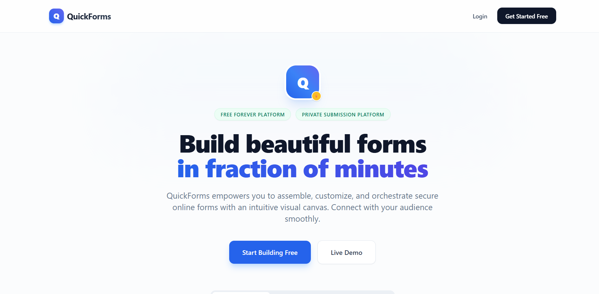
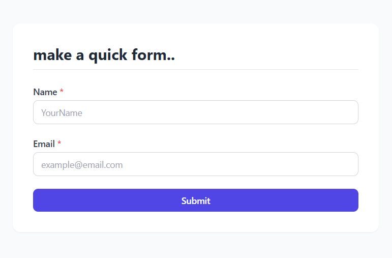

# QuickForm

A full-stack form builder application where users can create, publish, and share custom forms — and collect responses in real time.

**Live Demo:** [quickform.vercel.app](https://quickform.vercel.app)

---

## Screenshots

| Home Page | Field Editor | Live Form
|---|---|---|
|  |  | 

---

## Features

- **Drag & Drop Form Builder** — reorder fields visually using dnd-kit
- **8 Field Types** — short text, long text, email, number, dropdown, checkbox, radio, date
- **Shareable Public Forms** — every form gets a unique public URL, no login required to fill
- **Response Dashboard** — view all submissions in one place
- **CSV Export** — download all responses as a CSV file
- **Email Notifications** — form owner gets an email on every new submission
- **JWT Authentication** — secure register, login, and protected routes
- **Publish / Unpublish** — control when your form accepts responses

---

## Tech Stack

### Backend
- Node.js + Express 5
- Prisma 6 ORM
- PostgreSQL via Neon
- JWT + bcryptjs (authentication)
- BullMQ + Upstash Redis (email queue)
- Nodemailer (email notifications)

### Frontend
- React 18 + Vite 5
- Tailwind CSS v3
- React Router v6
- dnd-kit (drag and drop)
- Axios

### Deployment
- Backend → Render
- Frontend → Vercel
- Database → Neon PostgreSQL
- Redis → Upstash

---

## Project Structure

```
quickform/
├── backend/
│   ├── lib/
│   │   ├── db.js           # Prisma client singleton
│   │   └── redis.js        # Redis connection
│   ├── middleware/
│   │   └── auth.js         # JWT middleware
│   ├── prisma/
│   │   └── schema.prisma   # Database schema
│   ├── queues/
│   │   ├── emailQueue.js   # BullMQ queue
│   │   └── emailWorker.js  # Email worker
│   ├── routes/
│   │   ├── auth.js         # Register, login, me
│   │   ├── forms.js        # Form CRUD + publish
│   │   └── responses.js    # Submit, fetch, CSV
│   └── server.js
│
└── frontend/
    └── src/
        ├── components/
        │   ├── FieldCard.jsx   # Draggable field card
        │   └── Navbar.jsx
        ├── context/
        │   └── AuthContext.jsx
        ├── lib/
        │   └── api.js          # Axios instance
        └── pages/
            ├── Builder.jsx     # Drag & drop editor
            ├── Dashboard.jsx   # Form management
            ├── Login.jsx
            ├── PublicForm.jsx  # Public form page
            ├── Register.jsx
            └── Responses.jsx   # View + export responses
```

---

## Getting Started

### Prerequisites
- Node.js 18+
- PostgreSQL database (Neon recommended)
- Redis instance (Upstash recommended)

### Backend Setup

```bash
cd backend
npm install
```

Create a `.env` file:

```env
DATABASE_URL="your-neon-pooled-url"
DIRECT_URL="your-neon-direct-url"
JWT_SECRET="your-secret-key"
PORT=5000

SMTP_HOST=smtp.ethereal.email
SMTP_PORT=587
SMTP_USER=your-smtp-user
SMTP_PASS=your-smtp-pass
FROM_EMAIL=no-reply@quickform.dev

REDIS_URL="rediss://your-upstash-url"
```

Run migrations and start:

```bash
npx prisma migrate dev --name init
npm run dev
```

### Frontend Setup

```bash
cd frontend
npm install
```

Create a `.env` file:

```env
VITE_API_URL=http://localhost:5000/QuickForm
```

Start the dev server:

```bash
npm run dev
```

---

## API Endpoints

### Auth
| Method | Endpoint | Description |
|--------|----------|-------------|
| POST | `/QuickForm/auth/register` | Register a new user |
| POST | `/QuickForm/auth/login` | Login |
| GET | `/QuickForm/auth/me` | Get current user |

### Forms
| Method | Endpoint | Description |
|--------|----------|-------------|
| GET | `/QuickForm/forms` | Get all forms (owner) |
| POST | `/QuickForm/forms` | Create a new form |
| GET | `/QuickForm/forms/:id` | Get single form |
| PUT | `/QuickForm/forms/:id` | Update form |
| DELETE | `/QuickForm/forms/:id` | Delete form |
| PATCH | `/QuickForm/forms/:id/publish` | Toggle publish |
| GET | `/QuickForm/forms/public/:slug` | Get public form by slug |

### Responses
| Method | Endpoint | Description |
|--------|----------|-------------|
| POST | `/QuickForm/responses/:formId` | Submit a response |
| GET | `/QuickForm/responses/:formId` | Get all responses |
| GET | `/QuickForm/responses/:formId/csv` | Download as CSV |

---

## Database Schema

```prisma
model User {
  id        Int      @id @default(autoincrement())
  name      String
  email     String   @unique
  password  String
  forms     Form[]
  createdAt DateTime @default(now())
}

model Form {
  id          Int        @id @default(autoincrement())
  title       String
  slug        String     @unique
  fields      Json       @default("[]")
  isPublished Boolean    @default(false)
  userId      Int
  user        User       @relation(fields: [userId], references: [id], onDelete: Cascade)
  responses   Response[]
  createdAt   DateTime   @default(now())
}

model Response {
  id          Int      @id @default(autoincrement())
  answers     Json
  formId      Int
  form        Form     @relation(fields: [formId], references: [id], onDelete: Cascade)
  submittedAt DateTime @default(now())
}
```

---

## Deployment

### Backend (Render)
- Root Directory: `backend`
- Build Command: `npm install && npx prisma generate`
- Start Command: `node server.js`
- Add all environment variables from `.env`

### Frontend (Vercel)
- Root Directory: `frontend`
- Framework: Vite
- Build Command: `npm run build`
- Output Directory: `dist`
- Environment Variable: `VITE_API_URL=https://your-render-url.onrender.com/QuickForm`

---

## Author

**Rahul Biswas**
- GitHub: [@RahulBiswas224](https://github.com/RahulBiswas224)
- Portfolio: [portfolio-ecosystem-qdec.vercel.app](https://portfolio-ecosystem-qdec.vercel.app)

---

## License

MIT
